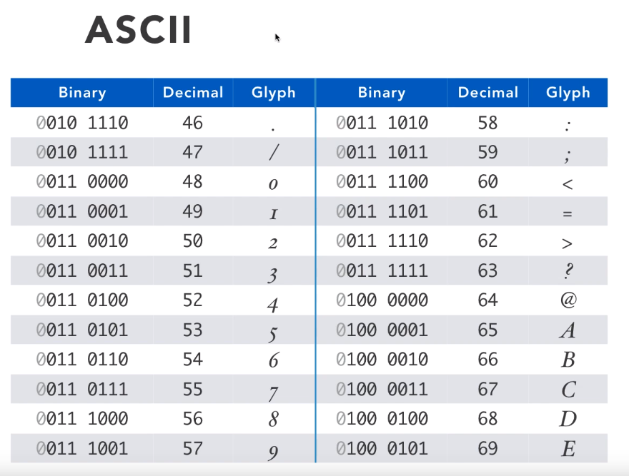
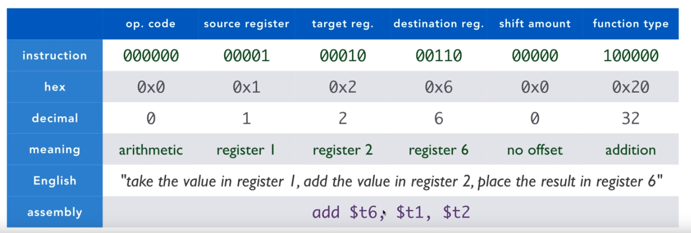
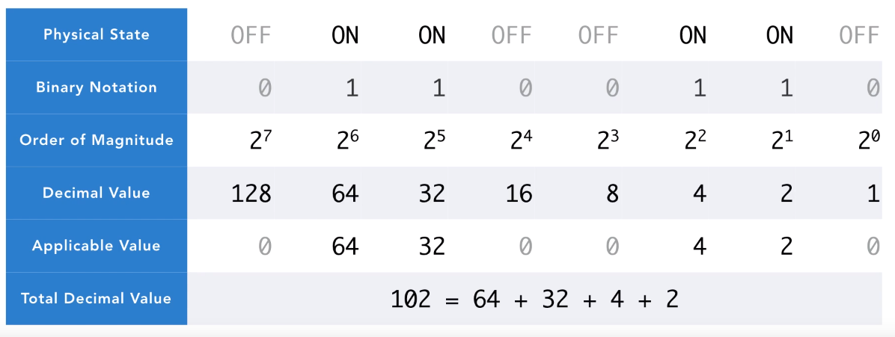
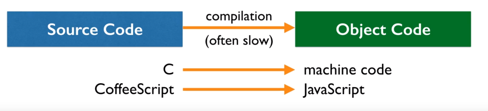
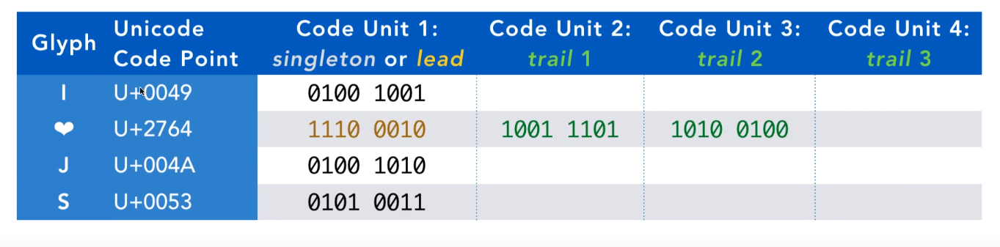

# Introducción a Ciencias de la Computación

Computer Science es el estudio de procesos algorítmicos, sistemas computacionales y las computadoras

### Teoría Computacional

Aquí se encuentra el aprendizaje y análisis de algoritmos. Un algoritmo es una sucesión de pasos ordenados que al repetirse de forma sistemática logra resolver un prblema. A su vez, los algoritmos traen consigo un nuevo concepto, la complejidad.
Por otro lado, en este mismo se encuentra la tería de grafos, criptografía, hardware y estructuras de datos. Estos últimos se utilizan para organizar los datos de forma eficiente para su posterior uso.

### Aplicaciones

En última instancia, ingeniería computacional. En esta instancia podemos encontrar ingeniería del software, donde prevalece el desarrollo del mismo. El conocimiento y desarrollo de diversos lenguajes de programación, arquitectura de computadoras, compiladores de código, entre otros.

### Lenguaje de Maquina
Recordemos que las computadoras, solo entienden 0s y 1s. Ahora bien, ¿Nosotros escribimos en 1's y 0's? No. Existen lenguajes de alto y bajo nivel que luego deben ser traducidos a lenguaje maquina, lenguaje interpretable por la computadora. La "traducción" lo llamaremos compilación.

### ASCII

### Assembly

### Binario

### Compilation

### UTF8
