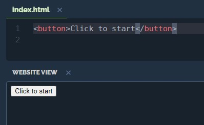

[![Build Status][travis-image]][travis-url]

# __Conceptos básicos de HTML__
Crea páginas web usando etiquetas __`HTML`__.


## __Descubriendo HTML y Etiquetas__


# __HTML__
__HTML__ es el lenguaje informático que estructura todas las páginas web de Internet. El código HTML le dice a los navegadores web cómo mostrar contenido como _imágenes_ y _texto_ en una página web.


# __< button >__
__< button >__ es una etiqueta de apertura. Le dice al navegador web que queremos comenzar a mostrar un `botón`. __</ button >__ cierra la etiqueta

```html
<button>Click to start</button>
```



[travis-image]: https://img.shields.io/travis/dbader/node-datadog-metrics/master.svg?style=flat-square
[travis-url]: https://anayaricardo.netlify.app/
