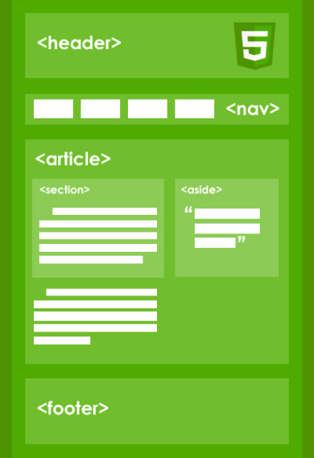

# __Conceptos básicos de HTML__
### _Crea páginas web usando etiquetas HTML_


## __Descubriendo HTML y Etiquetas__


__HTML__ es el lenguaje informático que estructura todas las páginas web de Internet. El código HTML le dice a los navegadores web cómo mostrar contenido como _imágenes_ y _texto_ en una página web.

__< button >__ es una etiqueta de apertura. Le dice al navegador web que queremos comenzar a mostrar un botón. __</ button >__

```html
<button>Click to start</button>
```